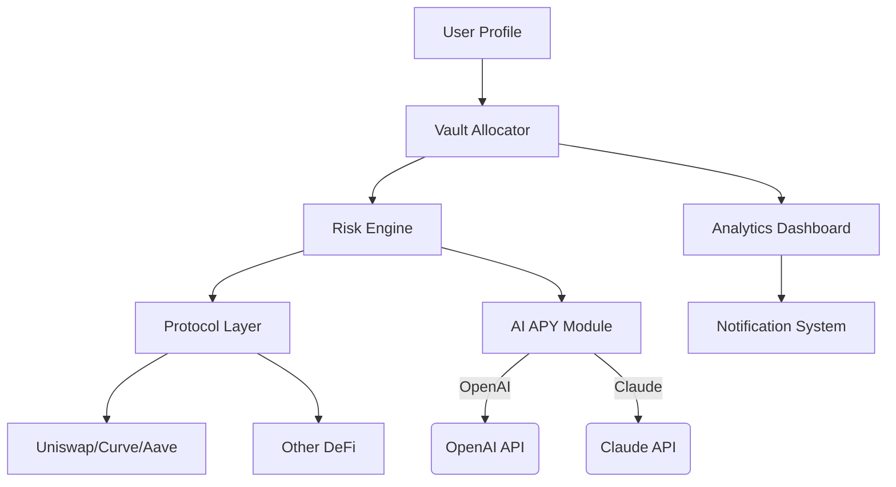

# AutoDeFiVaults

A next-generation vault automation platform enhancing decentralized finance (DeFi) security, diversification, and yield scalability.

---

## 🧭 Overview

**AutoDeFiVaults** elevates DeFi participation for both casual investors and yield strategists. Going beyond simple yield farming, AutoDeFiVaults dynamically allocates capital into diversified vault strategies, safeguards funds with intelligent risk engines, and offers a codeless configuration system. Whether you're new to digital assets or a yield aggregator optimizing at scale, AutoDeFiVaults is designed for robust performance across multiple decentralized blockchains.

Unlike many automated vaults, our system introduces modular risk profiles, AI-enhanced APY forecasting, and cross-protocol migration — all wrapped in an intuitive, multilingual, and responsive interface with global 24/7 support.

---

## 📥 Download

Start by visiting our download portal:

---

## 🎯 Key Features

- **Vault Abstraction Layer:** Seamlessly bundles staking, lending, and liquidity farming into universally accessible vaults.
- **Configurable Risk Profiles:** Choose from Conservative, Balanced, or Aggressive strategies — or customize your own.
- **AI-Driven APY Forecasting:** Predict optimal vaults using the latest OpenAI and Claude models.
- **Cross-Chain Migration:** Withdraw from one protocol, deposit into another, all in a single command.
- **Responsive Interface:** Built for web, desktop, and mobile with real-time vault stats and notifications.
- **Multilingual Support:** Localized for English 🇬🇧, Spanish 🇪🇸, Simplified Chinese 🇨🇳, and Hindi 🇮🇳.
- **24/7 Human-Powered Support:** Lightning-fast response, anytime, anywhere.
- **Secure & Audited:** Smart contracts are publicly verifiable; regular third-party audit reports.
- **OpenAI and Claude API Integrations:** Strategize using conversational AI or leave rebalancing to the bots.
- **No-code Profile Management:** Deploy and manage DeFi strategies without writing a line of code.
- **Rich Analytics Dashboard:** Visualize portfolio health, performance, and risk at a glance.
- **Plug & Play DeFi Integrations:** Uniswap, Curve, Aave, Compound, Sushiswap, and more.

---

## 🚀 SEO-Friendly DeFi Keywords in Action

- Automated DeFi vault management  
- Cross-chain yield optimization  
- AI-driven APY and risk prediction  
- Multilingual DeFi dashboard  
- Secure, decentralized vault migration  
- Real-time DeFi analytics  
- Smart contract automation  
- DeFi diversification strategies

Harness the power of decentralized finance automation with proactive security, intelligent yield chasing, and global accessibility.

---

## ⚡️ Example Console Invocation

Want to allocate into an “Aggressive Growth” vault across protocols using your custom profile? Here’s the CLI power at your fingertips:

    autodefivaults allocate --profile aggressive_growth.json --migrate --amount 1000 DAI

Want to get a forecast report generated by AI? Just ask:

    autodefivaults forecast --strategy "Conservative Yield" --use-ai openai

---

## 🕹️ Example Profile Configuration

Configure your personal vault strategy in a single JSON file:

    {
      "profileName": "Balanced Growth 2026",
      "chains": ["Ethereum", "Polygon", "Arbitrum"],
      "riskLevel": "Balanced",
      "allocation": {
        "UniswapV3": 40,
        "Curve": 30,
        "Aave": 20,
        "Sushiswap": 10
      },
      "autoRebalance": true,
      "language": "en",
      "notifications": {
        "email": "user@email.com",
        "telegram": "@username"
      }
    }

---

## 🌐 OS Compatibility

| Platform   | Supported | Interface Type  | Status      |
|------------|:---------:|:---------------:|:-----------:|
| 🖥️ Windows |    ✅    | Desktop, CLI    | Stable      |
| 🍎 macOS   |    ✅    | Desktop, CLI    | Stable      |
| 🐧 Linux   |    ✅    | Desktop, CLI    | Stable      |
| 📱 iOS     |    ✅    | Web, Mobile App | Beta        |
| 🤖 Android |    ✅    | Web, Mobile App | Beta        |
| 🌍 Web     |    ✅    | Browser UI      | Stable      |

---

## 🗺️ Project Architecture

Visualization of AutoDeFiVaults architecture, modular strategies, and AI integrations:

---

## 🤖 OpenAI & Claude API Integration

Harness advanced AI models for:

- **Strategy Recommendation:** Get tailored DeFi strategy suggestions.
- **APY Prediction:** Real-time, AI-powered forecasting for vault returns using both OpenAI and Claude APIs.
- **Risk Assessment:** Conversational risk/reward evaluation via AI insights.

Simply activate with CLI flags `--use-ai openai` or `--use-ai claude` or through Dashboard toggle.

---

## 📜 License

AutoDeFiVaults is MIT licensed. For details, see the LICENSE file or visit:  
[MIT License](https://opensource.org/licenses/MIT)

---

## 📢 Disclaimer

*AutoDeFiVaults* provides intelligent automation for decentralized finance, but users are ultimately responsible for risk and capital loss beyond the platform’s managed safeguards. Past APY performance is not indicative of future results. Exercise prudent risk management and conduct your own research. This platform does not provide financial advice.

---

## 🛠 How to Install

To deploy AutoDeFiVaults for 2026, download the latest release:

---